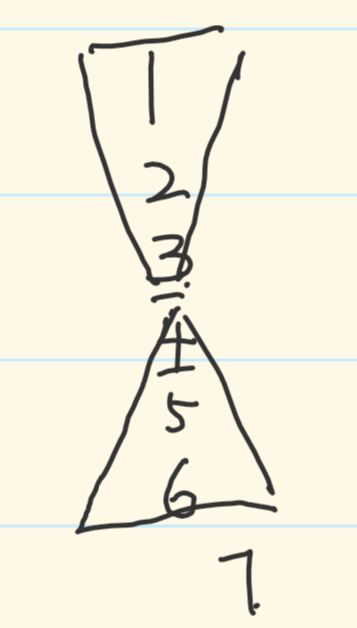

## 剑指offer

### [正则表达式匹配](https://www.acwing.com/problem/content/28/)

[solve](https://www.acwing.com/solution/content/3390/)

??? "solve"
    ```cpp
    class Solution {
    public:
        bool isMatch(string str, string pattern) {
            vector<vector<bool>> dp(str.length() + 1, vector(pattern.size() + 1, false));
            dp[0][0] = true;
            for (int i = 0; i <= str.length(); i++)
                for (int j = 1; j <= pattern.size(); j++) {
                    if ((i > 0) &&
                        (pattern[j - 1] == '.' ||
                        pattern[j - 1] != '*' && pattern[j - 1] == str[i - 1]))
                        dp[i][j] = dp[i - 1][j - 1];
                    else if (pattern[j - 1] == '*') {
                        if (j > 1 && dp[i][j - 2] == true)
                            dp[i][j] = true;
                        else if ((i > 0 && j > 1) &&
                                (pattern[j - 2] == str[i - 1] || pattern[j - 2] == '.')
                                && dp[i - 1][j] == true)
                            dp[i][j] = true;
                    }
                }
            return dp[str.length()][pattern.size()];

        }
    };
    ```

### [二叉树的下一个节点](https://www.acwing.com/problem/content/description/31/)

- 中序遍历**左根右**
- 如果不是叶节点，要求的点相当于先往右一步，再一直往左走到头,是一个 **>** 的形状
- 如果是叶节点**A**，可以先考虑它的下一个节点**B**怎么到的它本身，
    - 就是**B**先往左一步，再往右走到头到达**A**，形成一个 **<** 的形状
    - 然后发现拐角处容易求出来 `p->father->left==p`
    - 如果说没有父节点，说明没有要求的答案，返回 `nullptr`

??? slove
    ```cpp
    class Solution {
    public:
        TreeNode *inorderSuccessor(TreeNode *p) {
            if (p->right != nullptr) {
                p = p->right;
                while (p->left != nullptr)
                    p = p->left;
                return p;
            }
            else {
                while (p->father != nullptr && p->father->left != p)
                    p = p->father;
                if (p->father == nullptr)
                    return nullptr;
                else
                    return p->father;
            }
        }
    };
    ```


### [旋转数组的最小数字](https://www.acwing.com/problem/content/description/20/)

- 从后往前把和 `nums[0]` 相同的删除
- 特判一下：如果是完全升序就返回 ` nums[0]`
- 进行二分查找 小于 `nums[0]` 的左端点

[辅助题解](https://www.acwing.com/solution/content/727/)

??? slove
    ```cpp
    class Solution {
    public:
        int findMin(vector<int>& nums) {
            if(nums.size()==0) return -1;
            int n=nums.size()-1;
            while (n>0&&nums[0]==nums[n]) n--;
            if(nums[n]>=nums[0]) return nums[0];
            
            int l=0,r=n;
            while (l<r){
                int mid=l+r>>1;
                if(nums[mid]<nums[0]) r=mid;
                else l=mid+1;
            }
            return nums[l];
        }
    };
    ```

**举一反三**😋

这个题做完了，可以尝试[搜索旋转排序数组](https://leetcode.cn/problems/search-in-rotated-sorted-array/description/)

- 先特判一下是不是完全升序，决定是不是直接二分
- 和上一题一样，先找到最小值
- 如果目标值在最小值和结尾中间就二分，反之在另一半二分

??? solve
    ```cpp
    class Solution {
    public:
        int search(vector<int> &nums, int target) {

            if (nums[nums.size() - 1] > nums[0])
                return bins(nums, 0, nums.size() - 1, target);

            int l = 0, r = nums.size() - 1;
            while (l < r) {
                int mid = l + r >> 1;
                if (nums[mid] < nums[0]) r = mid;
                else l = mid + 1;
            }
            cout << nums[l] << endl;

            if (target >= nums[l] && target < nums[0])
                return bins(nums, l, nums.size() - 1, target);
            else
                return bins(nums, 0, l - 1, target);

        }

        int bins(vector<int> &nums, int l, int r, int target) {
            while (l < r) {
                int mid = l + r >> 1;
                if (nums[mid] >= target)
                    r = mid;
                else l = mid + 1;
            }
            if (nums[l] != target) return -1;
            else return l;
        }
    };
    ```

### [矩阵中的路径](https://www.acwing.com/problem/content/21/)

为什么这个不能调过来

```cpp
//correct
if (matrix[x][y] != str[po]) return false;
if (po == str.size() - 1) return true;
// wrong
if (po == str.size()) return true;
if (matrix[x][y] != str[po]) return false;  
```

这个例子 `str=a martix=[a]`

第一步成功了，但是在继续dfs的时候是不能继续dfs的，因为 `if (!(cx >= 0 && cx < n && cy >= 0 && cy < m)) continue;` 下标全都越界，进入 `continue` ,没法进入预计的 `dfs(1)`

??? slove
    ```cpp
    class Solution {
    public:
        bool hasPath(vector<vector<char>> &matrix, string &str) {
            if (matrix.size() == 0) return false;
            bool ff = false;

            int n = matrix.size();
            int m = matrix[0].size();

            for (int i = 0; i < n; ++i) {
                for (int j = 0; j < m; ++j) {
                    if (dfs(i, j, 0, str, matrix)) {
                        ff = true;
                        break;
                    }
                }
            }
            if (ff) return true;
            else return false;

        }

        bool dfs(int x, int y, int po, string &str, vector<vector<char>> &matrix) {
            if (matrix[x][y] != str[po]) return false;
            if (po == str.size() - 1) return true;

            int dx[4] = {-1, 1, 0, 0};
            int dy[4] = {0, 0, -1, 1};
            int n = matrix.size();
            int m = matrix[0].size();

            char tem = matrix[x][y];
            matrix[x][y] = '*';
            for (int i = 0; i < 4; ++i) {
                int cx = x + dx[i];
                int cy = y + dy[i];
                if (!(cx >= 0 && cx < n && cy >= 0 && cy < m)) continue;
                if (dfs(cx, cy, po + 1, str, matrix))
                    return true;
            }
            matrix[x][y] = tem;
            return false;
        }
    };
    ```

### [二进制中1的个数](https://www.acwing.com/problem/content/description/25/)

1. 循环32次，每次判断最低位是不是1，再右移一位
2. lowbit操作，求一次 [lowbit](https://oi-wiki.org/ds/fenwick/) ,anw++； 数字-lowbit

=== "循环32次"

    ```cpp
    class Solution {
    public:
    int NumberOf1(int n) {

        int anw=0;

        for(int i=0;i<32;i++){
            if(n&1) anw++;
            n>>=1;
        }
        return anw;
    }
    };
    ```

=== "lowbit"

    ```cpp
    class Solution {
    public:
    int NumberOf1(int n) {
        int anw=0;
        while(n!=0){
            n=n-(n&-n); anw++;
        }
        return anw;
    }
    };
    ```


### [删除链表中重复的节点](https://www.acwing.com/problem/content/description/27/)

- 我理解此题关键在于**重复数字区间起点的前一个节点**，如果找区间的起点，不方便修改区间起点前一个的指向
- 为了方便删除开始就有相同的情况，在头节点前开一个假的节点 `vir`
- p指向vir，当p的下一个值是重复的一段 `[p->next,lat]` ，lat前进
    - 如果重复， `p->next=lat->next` ;但是不能保证p直接进入 `p->next` 后不重复。
        - 反例： `1, 2, 3, 3, 4, 4, 5`
    - 不重复，这个时候已经保证p，p的下一个，p的下第二个都不是重复，放心大胆的往下连接🥰

??? slove
    ```cpp
    class Solution {
    public:
        ListNode *deleteDuplication(ListNode *head) {
            ListNode *vir = new ListNode(-1);
            vir->next = head;
            
            ListNode *p = vir;

            while (p->next){
                ListNode* lat=p->next;
                while (lat->next&&lat->next->val==p->next->val)
                    lat=lat->next;
                if(p->next==lat){
                    p->next=lat;
                    p=p->next;
                }
                else{
                    p->next=lat->next;
                }
            }
            return vir->next;
        }
    };
    ```


### [调整数组顺序使奇数位于偶数前面](https://www.acwing.com/problem/content/description/30/)

- 双指针，一个从前往后找偶数，一个从后往前找奇数，不重复就交换，重复就退出
- 还尝试用归并去求，但是TLE了，原理应该是对的,还能保证相对顺序
    - 把左区间结尾的偶数和右区间的奇数进行互换


??? "双指针，归并"
    ```cpp
    class Solution {
    public:
        void reOrderArray(vector<int> &array) {
            if(array.size()==0) return;
            int l = 0, r = array.size() - 1;
            while(l<r){
            while (l < r && array[l] % 2 !=0) l++;
            while (l<r&&array[r]%2==0) r--;
            if(l==r) return;
            else swap(array[l],array[r]);}
        }

        vector<int> mergesort(vector<int> &array, int l, int r) {
            if (l >= r) return array;
            int mid = l + r >> 1;
            mergesort(array, 0, mid);
            mergesort(array, mid + 1, r);

            int i = mid, j = mid + 1;
            vector<int> tem;

            while (i >= 0 && j <= r && array[i] % 2 == 0 && array[j] % 2 != 0)
                swap(array[i--], array[j--]);
            return array;

        }
    };
    ```

### [反转链表](https://www.acwing.com/problem/content/33/)

老生常谈了，刚学链表的时候受不了直接投降😰。力扣的递归感觉不是一下就理解了，我这个应该好一些

=== "迭代"

    ```cpp
    class Solution {
        public:
        ListNode* reverseList(ListNode* head) {

            if(head== nullptr) return head;
            ListNode* pre= nullptr;
            while (head!= nullptr){
                ListNode*lat=head->next;
                head->next=pre;
                pre=head;
                head=lat;
            }
            return pre;
        }
    };
    ```

=== "递归"

    ```cpp
    class Solution {
    public:
        ListNode *reverseList(ListNode *head) {

            if (head == nullptr) return head;
            return rev(head, nullptr);
        }

        ListNode *rev(ListNode *head, ListNode *pre) {
            if (head == nullptr) return pre;

            auto tem = head->next;
            head->next = pre;
            //先修改当前的next，再递归下一个
            auto anw = rev(tem, head);
            return anw;

        }
    };
    ```

### [树的子结构](https://www.acwing.com/problem/content/35/)

想出来一部分😰

??? slove
    ```cpp
    class Solution {
    public:
        bool hasSubtree(TreeNode *pRoot1, TreeNode *pRoot2) {
            if (pRoot2 == nullptr || pRoot1 == nullptr) return false;
            if (check(pRoot1, pRoot2))
                return true;
            return hasSubtree(pRoot1->left, pRoot2) || hasSubtree(pRoot1->right, pRoot2);
            //1--p1,p2为根就相同
            //2--p1的左子树里和p2相同
            //3--p1的右子树里和p2相同
        }

        bool check(TreeNode *p1, TreeNode *p2) {
            if (p2 == nullptr) return true;//条件成立
            if (p1 == nullptr) return false;//2空1不空
            if (p1->val != p2->val) return false;//12都不空且值不同
            return check(p1->left, p2->left) && check(p1->right, p2->right);
        }
    };
    ```

### [对称的二叉树](https://www.acwing.com/problem/content/description/38/)

直接看代码更好理解

1. 递归检查两个节点a,b的值，a的左子树和b的右子树，a的右子树和b的左子树是否相同 👍👍👍
2. bfs a,b的值，a的左子树和b的右子树，a的右子树和b的左子树是否相同 👍👍
3. bfs 把下一层的值全存起来看是不是对称 👍

=== "递归"

    ```cpp
    class Solution {
    public:
        bool isSymmetric(TreeNode *root) {

            if (root == nullptr) return true;
            return dfs(root->left, root->right);
        }

        bool dfs(TreeNode *l1, TreeNode *l2) {
            if (l1 == nullptr || l2 == nullptr)
                return l1 == nullptr && l2 == nullptr;
            //非常的精妙啊
            return l1->val == l2->val && dfs(l1->left, l2->right)
                && dfs(l1->right, l2->left);
        }
    };
    ```

=== "bfs左右"

    ```cpp
    class Solution {
    public:
        bool isSymmetric(TreeNode *root) {
            if (root == nullptr) return true;
            return bfs(root);
        }

        bool bfs(TreeNode *root) {
            queue<TreeNode *> qu;
            qu.push(root->left);
            qu.push(root->right);
            while (qu.size()) {
                TreeNode *left = qu.front();
                qu.pop();
                TreeNode *right = qu.front();
                qu.pop();
                if (left == nullptr && right == nullptr)
                    continue;
                if (left == nullptr && right != nullptr ||
                    left != nullptr && right == nullptr ||
                    left->val != right->val)
                    return false;

                qu.push(left->left);
                qu.push(right->right);
                qu.push(left->right);
                qu.push(right->left);
            }
            return true;
        }
    };
    ```

=== "bfs全存"

    ```cpp
    class Solution {
    public:
        bool isSymmetric(TreeNode *root) {
            if (root == nullptr) return true;
            return bfs(root);
        }

        bool bfs(TreeNode *root) {
            queue<TreeNode *> qu;
            qu.push(root);
            while (qu.size()) {
                vector<TreeNode *> newqu;
                while (qu.size()) {
                    auto tem = qu.front();
                    qu.pop();
                    if (tem == nullptr) continue;
                    newqu.push_back(tem->left);
                    newqu.push_back(tem->right);
                }

                for (int i = 0, j = newqu.size() - 1; i < j;) {

                    if (newqu[i] == nullptr && newqu[j] != nullptr
                        || newqu[i] != nullptr && newqu[j] == nullptr)
                        return false;
                    if(newqu[i]== nullptr&&newqu[j]== nullptr) 
                    {i++,j--;continue;}
                    if (newqu[i]->val == newqu[j]->val) i++, j--;
                    else return false;
                }

                for (auto x: newqu) {
                    qu.push(x);
                }

            }


            return true;
        }
    };
    ```

### [栈的压入、弹出序列](https://www.acwing.com/problem/content/40/)

[题解](https://www.acwing.com/solution/content/44046/)

??? "slove"
    ```cpp
    class Solution {
    public:
        bool isPopOrder(vector<int> pushV,vector<int> popV) {
            if(pushV.size()!=popV.size()) return false; //两个序列长度不等，直接返回false
            int k=0;
            stack<int>st;
            for (int i = 0; i < popV.size(); ++i) {
                while (st.empty()||st.top()!=popV[i]&&k<pushV.size()) 
                    st.push(pushV[k++]);
                if(st.top()==popV[i]) st.pop();
                else return false;
            }
            return st.empty();
        }
    };
    ```

### [分行从上往下打印二叉树](https://www.acwing.com/problem/content/42/)

用一个变量记录一下本层处理几个就好了

??? "slove"
    ```cpp
    class Solution {
    public:
        vector<vector<int>> printFromTopToBottom(TreeNode *root) {

            vector<vector<int>> anw;
            if (root == nullptr) return anw;
            queue<TreeNode *> qu;
            qu.push(root);
            while (qu.size()) {
                vector<int> res;
                int k = qu.size();
                while (k--) {
                    auto tem = qu.front();
                    qu.pop();
                    res.push_back(tem->val);
                    if (tem->left != nullptr) qu.push(tem->left);
                    if (tem->right != nullptr) qu.push(tem->right);
                }
                anw.push_back(res);
            }
        }
    };
    ```

### [二叉树中和为某一值的路径](https://www.acwing.com/problem/content/description/45/)

dfs思路，处理本层，判断下一层

一些小坑：

- 有可能 **没到结尾（路径端点）时结果就相等** ，但是这不是我们要的
- 如果传引用注意回复现场

=== "传值"

    ```cpp
    class Solution {
    public:

        vector<vector<int>> anw;

        vector<vector<int>> findPath(TreeNode *root, int sum) {
            vector<int> tem;
            dfs(root, 0, sum, tem);
            return anw;
        }

        void dfs(TreeNode *root, int now, int sum, vector<int> tem) {

            if (root == nullptr) return;

            now += root->val;
            tem.push_back(root->val);
            if (now == sum&&root->left== nullptr&&root->right== nullptr) {
                anw.push_back(tem);
                return;
            }
            if (root->left != nullptr) {
                dfs(root->left, now, sum, tem);
            }
            if (root->right != nullptr) {
                dfs(root->right, now, sum, tem);
            }
        }
    };
    ```

=== "传引用"

    ```cpp
    class Solution {
    public:

        vector<vector<int>> anw;

        vector<vector<int>> findPath(TreeNode *root, int sum) {
            vector<int> tem;
            dfs(root, 0, sum, tem);
            return anw;
        }

        void dfs(TreeNode *root, int now, int sum, vector<int>& tem) {

            if (root == nullptr) return;

            now += root->val;
            tem.push_back(root->val);
            if (now == sum&&root->left== nullptr&&root->right== nullptr) {
                anw.push_back(tem);
                //取消掉注释也可以，但是popback不能丢
                //不然既没进入最后的poopback也没回复现场
                // tem.pop_back();
                // return;
            }
            
            dfs(root->left, now, sum, tem);
            dfs(root->right, now, sum, tem);
            tem.pop_back();
        }
    };
    ```


### [复杂链表的复刻](https://www.acwing.com/problem/content/description/89/)

[直接看视频题解](https://www.acwing.com/video/172/)

这是人能想出来的？😰 多复习复习吧

??? "solve"
    ```cpp
    class Solution {
    public:
        ListNode *copyRandomList(ListNode *head) {

            if (head == nullptr) return head;

            auto p = head;
            while (p != nullptr) {
                ListNode *np = new ListNode(p->val);
                auto next = p->next;
                np->next = next;
                p->next = np;
                p = p->next->next;
            }

            p = head;
            while (p != nullptr) {
                if (p->random != nullptr)
                    p->next->random = p->random->next;
                p = p->next->next;
            }

            ListNode *vir = new ListNode(-1);
            p = head;
            ListNode *cur = vir;
            while (p != nullptr) {
                cur->next = p->next;
                p->next = p->next->next;
                p = p->next;
                cur = cur->next;
            }
            return vir->next;
        }
    };
    ```

### [二叉搜索树与双向链表](https://www.acwing.com/problem/content/description/87/)

还真是人能想出来的，我想不出来，所以我不是人。 多复习复习吧

??? "slove"
    ```cpp
    class Solution {
    public:
    
        TreeNode *pre = nullptr;

        TreeNode *convert(TreeNode *root) {

            if (root == nullptr) return nullptr;
            midread(root);
            while (root->left != nullptr)
                root = root->left;
            return root;

        }

        void midread(TreeNode *root) {
            if (root == nullptr) return;
            midread(root->left);

            root->left = pre;
            if (pre) pre->right = root;
            pre = root;

            midread(root->right);
        }
    };
    ```

### [数据流中的中位数](https://www.acwing.com/problem/content/description/88/)

用两个堆动态维护序列，最大堆放比中位数小的值，最小堆放比中位数大的值，想法很精妙，实现方法也比较多

- 可以先往最小堆里放，也可以先往最大堆里放，我这个先放到最小堆
- 如果两个堆顶逆序，调整，如果最小堆数量==最大堆数量，把最小堆的堆顶放到最大堆里
- 取的时候，如果元素个数为奇数，取最大堆堆顶，偶数取两个堆顶平均值

{ loading=lazy }

??? "solve"
    ```cpp
    class Solution {
    public:
        priority_queue<int, vector<int>, greater<>> minheap;
        priority_queue<int, vector<int>, less<>> maxheap;

        void insert(int num) {
            minheap.push(num);
            if (maxheap.size() && minheap.top() < maxheap.top()) {
                int minv = minheap.top(), maxv = maxheap.top();
                minheap.pop(), maxheap.pop();
                minheap.push(maxv), maxheap.push(minv);
            }
            if (minheap.size() > maxheap.size()) {
                maxheap.push(minheap.top());
                minheap.pop();
            }

        }

        double getMedian() {
            if ((maxheap.size() + minheap.size()) % 2 == 0) {
                return (maxheap.top() + minheap.top()) / 2.0;
            }
            else
                return maxheap.top();
        }
    };
    ```

### [连续子数组的最大和](https://www.acwing.com/problem/content/description/50/)

比较简单的一道题 

=== "空间On"

    ```cpp
    class Solution {
    public:
        int maxSubArray(vector<int>& nums) {

            vector<int>anw(nums.size());
            anw[0]=nums[0];
            for (int i = 1; i <nums.size(); ++i) {
                if(nums[i]+anw[i-1]>nums[i]) anw[i]=nums[i]+anw[i-1];
                else anw[i]=nums[i];
            }
            return *max_element(anw.begin(), anw.end());
        }
    };
    ```

=== "空间O1"

    ```cpp
    class Solution {
    public:
        int maxSubArray(vector<int>& nums) {

            vector<int>anw(nums.size());
            int pre=nums[0];
            int fin=nums[0];
            for (int i = 1; i <nums.size(); ++i) {
                if(pre>0) pre+=nums[i];
                else pre=nums[i];
                fin= max(fin,pre);
            }
            return fin;
        }
    };
    ```

### [求1+2+…+n](https://www.acwing.com/problem/content/80/)

短路或者开空间，开空间真是 大受震撼.jpg

=== "短路"

    ```cpp
    class Solution {
    public:
        int getSum(int n) {
            (n>0)&&(n+= getSum(n-1));
            return n;
        }
    };
    ```

=== "开空间"

    ```cpp
    class Solution {
    public:
        int getSum(int n) {
            char x[n][n+1];
            return sizeof(x)>>1;
        }
    };
    ```

### [把数组排成最小的数](https://www.acwing.com/problem/content/54/)

不好解释

??? "slove"

    ```cpp
    class Solution {
    public:
        string printMinNumber(vector<int> &nums) {
            string anw;
            if (nums.size() == 0) return anw;
            sort(nums.begin(), nums.end(), [](int a, int b) {
                if (to_string(a) + to_string(b) < to_string(b) + to_string(a))
                    return true;
                else return false;
            });
            for(int  x:nums){
                anw+= to_string(x);
            }
            return anw;
        }
    };
    ```

### [把数字翻译成字符串](https://www.acwing.com/problem/content/55/)

这个还好，最开始想的是dfs处理，看题解后发现还可以用跳台阶做。
都差不多😋

=== "dfs"

    ```cpp
    class Solution {
    public:

        int getTranslationCount(string s) {
            int anw = dfs(s, 0);
            return anw;
        }

        int dfs(string s, int po) {
            if (po >= s.size()) return 1;
            int cnt = 0;
            cnt += dfs(s, po + 1);

            if (po + 1 < s.size() && ((s[po] - '0') * 10 + (s[po + 1] - '0') <= 25)
                && (s[po] - '0') * 10 + (s[po + 1] - '0') != (s[po + 1] - '0')
                    )
                cnt += dfs(s, po + 2);
            return cnt;
        }
    };
    ```

=== "dp"

    ```cpp
    class Solution {
    public:
        int getTranslationCount(string s) {

            vector<int> dp(s.size() + 1, 0);
            dp[0] = 1;
            if (s.size() == 1) return dp[0];
            dp[1] = 1;
            for (int i = 2; i <= s.size(); ++i) {
                dp[i] = dp[i - 1];
                int a = s[i - 2] - '0', b = s[i - 1] - '0';
                if (a != 0 && a * 10 + b <= 25)
                    dp[i] += dp[i - 2];
            }

            return dp[s.size()];
        }
    };
    ```

### [礼物的最大价值](https://www.acwing.com/problem/content/56/)

- dfs时间超了，用dp
-  `grid[i][j]` 用过之后就没用了，可以直接存结果，节省一点空间

??? "不额外空间"

    ```cpp
    class Solution {
    public:
        int getMaxValue(vector<vector<int>>& grid) {

            int m=grid.size(),n=grid[0].size();
            for (int i = 0; i < m; ++i) {
                for (int j = 0; j < n; ++j) {
                    if(i&&j) grid[i][j]+= max(grid[i-1][j],grid[i][j-1]);
                    else if(i) grid[i][j]+=grid[i-1][j];
                    else if(j) grid[i][j]+=grid[i][j-1];
                }
            }
            return grid[m-1][n-1];
        }
    };
    ```

??? "额外空间"

    ```cpp
    class Solution {
    public:
        int getMaxValue(vector<vector<int>> &grid) {
            int m = grid.size(), n = grid[0].size();

            vector<vector<int>> dp(grid.size() + 1,
                                vector<int>(grid[0].size() + 1,0));
            for (int i = 0; i <= m; ++i)
                dp[m][0] = 0;
            for (int i = 0; i <= n; ++i) {
                dp[0][n] = 0;
            }

            for (int i = 1; i <= m; ++i) {
                for (int j = 1; j <= n; ++j) {
                    dp[i][j] = max(dp[i][j - 1], dp[i - 1][j]) + grid[i - 1][j - 1];
                }
            }
            return dp[m][n];
        }
    };
    ```

### [最长不含重复字符的子字符串](https://www.acwing.com/problem/content/57/)

- 推荐方法：双指针+哈希表
- 第二种方法： [dp解释](https://leetcode.cn/problems/zui-chang-bu-han-zhong-fu-zi-fu-de-zi-zi-fu-chuan-lcof/solutions/1220699/java-on-dong-tai-gui-hua-si-lu-qing-xi-z-w2ji/)


=== "双指针"

    ```cpp
    class Solution {
    public:
        int longestSubstringWithoutDuplication(string s) {
            if(s.empty()) return 0;
            int anw=1;
            unordered_map<char,int>map;
            for (int l = 0,r=0; r < s.size(); ++r) {
                map[s[r]]++;
                while (map[s[r]]>1){
                    map[s[l++]]--;
                }
                anw= max(anw,r-l+1);
            }
            return anw;
        }
    };
    ```

=== "dp"

    ```cpp
    class Solution {
    public:
        int longestSubstringWithoutDuplication(string s) {
            if (s.empty()) return 0;
            int anw = 1;
            vector<int> dp(s.size());
            unordered_map<char, int> map;
            for (int i = 0; i < s.size(); ++i) {
                if (i == 0) {
                    map[s[i]] = 0;
                    dp[0] = 1;
                    anw = 1;
                    continue;
                }
                int last = map[s[i]];
                if (map[s[i]] == 0 && s[0] != s[i])
                    dp[i] = dp[i - 1] + 1;
                else
                    dp[i] = min(dp[i - 1] + 1, i - last);
                anw = max(anw, dp[i]);
                map[s[i]] = i;
            }
            return anw;
        }
    };
    ```


### [0到n-1中缺失的数字](https://www.acwing.com/problem/content/description/64/)

二分 特征 `f[i]=i` `f[i]!=i`

??? "查后面的"

    ```cpp
    class Solution {
    public:
        int getMissingNumber(vector<int> &nums) {
            if(nums.size()==0) return 0;
            return midsearch(nums, 0, nums.size() - 1);
        }

        int midsearch(vector<int> nums, int l, int r) {
            while (l < r) {
                int val=nums[l+r>>1];
                int idx=l+r>>1;
                if(val>idx) r=idx;
                else l=idx+1;
            }
            if(nums[l]==l) return l+1;
            return l;
        }
    };
    ```

??? "查前边的"

    ```cpp
    class Solution {
    public:
        int getMissingNumber(vector<int> &nums) {
            if(nums.size()==0) return 0;
            if(nums.size()==1) return 1;
            return midsearch(nums, 0, nums.size() - 1);
        }

        int midsearch(vector<int> nums, int l, int r) {
            while (l < r) {
                int val=nums[l+r+1>>1];
                int idx=l+r+1>>1;
                if(idx==val) l=idx;
                else r=idx-1;
            }
            if(l==0) return 0;
            return l+1;
        }
    };
    ```

### [二叉搜索树的第k个结点](https://www.acwing.com/problem/content/description/66/)

dfs时进行计数

??? "dfs"

    ```cpp
    class Solution {
    public:
        TreeNode *kthNode(TreeNode *root, int k) {
            dfs(root, k);
            return anw;
        }

        TreeNode *anw = nullptr;

        void dfs(TreeNode *root, int &k) {
            if (root == nullptr) return;
            dfs(root->left, k);
            k--;
            if (k == 0) {
                anw = root;
                return;
            }
            dfs(root->right, k);

        }
    };
    ```


### [数组中只出现一次的两个数字](https://www.acwing.com/problem/content/description/69/)

偶数个相同的数字进行异或或等于0，0异或a等于a

- 先进行全部异或 `anw=x^y`
- 因为 `x!=y` 一定可以找到某一位（假定为k位）上的数字两者不同
- 就可以分成两类，k位是1，k位是0， **成对的数字不管分在哪一类进行异或后都是0**
- 分别异或就行了

??? "异或"

    ```cpp
    class Solution {
    public:
        vector<int> findNumsAppearOnce(vector<int> &nums) {

            int anw = 0;
            for (int i = 0; i < nums.size(); ++i) {
                anw = anw ^ nums[i];
            }

            int k = 0;
            while ((anw >> k & 1) == 0) { k++; }

            int t = 0;
            for (int i = 0; i < nums.size(); ++i) {
                if ((nums[i] >> k & 1) == 1) t = t ^ nums[i];
            }
            vector<int> res;
            res.push_back(anw ^ t);
            res.push_back(t);
            return res;
        }
    };
    ```


### [数组中唯一只出现一次的数字](https://www.acwing.com/problem/content/description/70/)

在一个数组中除了一个数字只出现一次之外，其他数字都出现了三次。

请找出那个只出现一次的数字。

1. int 32位，如果一个数出现3次，那么他的每一位都出现3次
2. 把所有数的每一位都统计一下，如果是3的倍数，那要求的答案在这一位上是0，否则为1

??? "solve"

    ```cpp
    class Solution {
    public:
        int findNumberAppearingOnce(vector<int> &nums) {

            int cnt[32] = {0};
            for (int i = 0; i < nums.size(); ++i) {
                int x = nums[i];
                for (int j = 0; j < 32; ++j) {
                    cnt[j] += (x >> j & 1);
                }
            }
            int anw = 0;
            for (int i = 31; i >= 0; i--) {
                anw = anw << 1;
                if (cnt[i] % 3)
                    anw += 1;
            }
            return anw;
        }
    };
    ```

### [和为S的连续正数序列](https://www.acwing.com/problem/content/72/)

1. 起始数字a,长度n `(a>=1,n>=2) (a+a+n-1)*n/2 =x` ，解方程
2. 双指针的滑动窗口

=== "解方程"

    ```cpp
    class Solution {
    public:
        vector<vector<int> > findContinuousSequence(int sum) {

            if (sum < 3) return vector<vector<int>>{};
            vector<vector<int>> res;
            for (int n = 2; n * (n + 1) / 2 <= sum; n++) {
                vector<int> anw;
                if (2 * sum % n == 0 && (2 * sum / n - n + 1) % 2 == 0) {
                    int a = (2 * sum / n - n + 1) / 2;
                    for (int i = a; i < n + a; ++i) {
                        anw.push_back(i);
                    }
                    res.push_back(anw);
                }
            }
            return res;
        }
    };
    ```

=== "滑动窗口"

    ```cpp
    class Solution {
    public:
        vector<vector<int> > findContinuousSequence(int sum) {
            vector<vector<int>> res;

            for (int l = 1, r = 2, total = 3; l <= sum / 2 + 1; l++) {
                while (total < sum)
                    r++, total += r;
                if (total == sum) {
                    vector<int> anw;
                    for (int k = l; k <= r; k++)
                        anw.push_back(k);
                    res.push_back(anw);
                    total -= l;
                }
                else
                    total -= l;
                //可以把上边两句合起来
            }
            return res;
        }
    };
    ```

### [左旋转字符串](https://www.acwing.com/problem/content/description/74/)

1. substr(beginPosi,cnt) `str.substr(n)+str.substr(0,n);`
2. 反转前一部分，反转后一部分，全部反转 ${(a^{-1}b^{-1})}^{-1} =ba$

### [滑动窗口的最大值](https://www.acwing.com/problem/content/description/75/)

窗口里比新进来小的数都没有用了，单调队列 [题解](https://www.acwing.com/solution/content/853/)

[可读性强的题解](https://github.com/youngyangyang04/leetcode-master/blob/master/problems/0239.%E6%BB%91%E5%8A%A8%E7%AA%97%E5%8F%A3%E6%9C%80%E5%A4%A7%E5%80%BC.md)

=== "可读性强"

    ```cpp
    class mydeque {
        deque<int> que;

    public:
        void push(int val) {
            while (!que.empty() && val > que.back())
                que.pop_back();
            que.push_back(val);
        }

        void pop(int val) {
            if (!que.empty() && que.front() == val)
                que.pop_front();
        }

        int get() {
            return que.front();
        }
    };

    class Solution {
    public:
        vector<int> maxInWindows(vector<int>& nums, int k) {
            vector<int> res;
            mydeque que;
            for (int i = 0; i < k; i++)
                que.push(nums[i]);

            res.push_back(que.get());

            for (int i = k; i < nums.size(); i++) {
                que.pop(nums[i - k]);
                que.push(nums[i]);
                res.push_back(que.get());
            }
            return res;
        }
    };

    ```

=== "可读性不强"

    ```cpp
    class Solution {
    public:
        vector<int> maxInWindows(vector<int>& nums, int k) {

            vector<int>anw;
            deque<int>qu;
            for (int i = 0; i < nums.size(); ++i) {
                if (!qu.empty() && i - qu.front() >= k) qu.pop_front();
                while (!qu.empty() && nums[i] > nums[qu.back()]) qu.pop_back();
                qu.push_back(i);
                if (i >= k - 1) anw.push_back(nums[qu.front()]);
            }
            return anw;
        }
    };
    ```

### [骰子的点数](https://www.acwing.com/problem/content/description/76/)

假设 `f[i][j]` 表示第i次投，总点数为j，可以从上一次的总点数+1,+2...+6，即 `f[i][j]=f[i-1][j-k]  1<=j-k`

=== "n2 1-6"

    ```cpp
    class Solution {
    public:
        vector<int> numberOfDice(int n) {

            vector<int> anw;
            vector<vector<int>> dp(n + 1, vector<int>(6 * n + 6, 0));

            for (int i = 1; i <= 6; i++)
                dp[1][i] = 1;

            for (int i = 2; i <= n; i++) {
                for (int j = i; j <= 6 * i; ++j) {
                    for (int k = 1; k <= 6; k++)
                        if (j - k > 0)
                            dp[i][j] += dp[i - 1][j - k];
                }
            }

            for (int i = n; i <= 6 * n; i++)
                anw.push_back(dp[n][i]);
            return anw;
        }
    };
    ```

=== "n2 另一种"

    ```cpp
    class Solution {
    public:
        vector<int> numberOfDice(int n) {

            vector<int> anw;

            vector<vector<int>> dp(n + 1, vector<int>(6 * n + 6, 0));

            for (int i = 1; i <= 6; i++)
                dp[1][i] = 1;


            for (int i = 2; i <= n; i++) {
                for (int j = i; j <= 6 * i; ++j) {
                    for (int k = j - 6; k <= j - 1; k++)
                        if (k >= i - 1 && k <= 6 * (i - 1))
                            dp[i][j] += dp[i - 1][k];

                }
                
            }

            for (int i = n; i <= 6 * n; i++)
                anw.push_back(dp[n][i]);
            return anw;
        }
    };
    ```

=== "On"

    ```cpp
    class Solution {
    public:
        vector<int> numberOfDice(int n) {

            vector<int> anw;
            vector<int> dp(6 * (n + 1), 0);

            for (int i = 1; i <= 6; i++)
                dp[i] = 1;


            for (int i = 2; i <= n; i++) {
                for (int j = i * 6; j >= i; --j) {
                    dp[j]=0;
                    for (int k = j - 6; k <= j - 1; k++)
                        if (k >= i - 1 && k <= 6 * (i - 1))
                            dp[j] += dp[k];

                }
            }

            for (int i = n; i <= 6 * n; i++)
                anw.push_back(dp[i]);
            return anw;
        }
    };
    ```

### [扑克牌的顺子](https://www.acwing.com/problem/content/description/77/)

1. 除了0以外不能出现两个相同的数字；
2. 排序后两个相邻数字的差值不能大于0的个数。

??? "solve"

    ```cpp
    class Solution {
    public:
        bool isContinuous(vector<int> nums) {

            if (nums.size() == 0) return false;
            int cnt = 0;
            std::sort(nums.begin(), nums.end());

            for (int i = 0; i < nums.size() - 1; ++i) {
                if (nums[i] == 0) {
                    cnt++;
                    continue;
                }
                if (nums[i] == nums[i + 1]) return false;
                if (nums[i + 1] - nums[i] > 1) {
                    cnt -= (nums[i + 1] - nums[i] - 1);
                    if (cnt < 0) return false;
                }
            }
            return true;
        }
    };
    ```


### [圆圈中最后剩下的数字](https://www.acwing.com/problem/content/description/78/)

约瑟夫环问题， [省流版](https://blog.csdn.net/yzyyylx/article/details/78473304
) ， [详细版](https://www.acwing.com/solution/content/796/)

??? "solve"

    ```cpp
    class Solution {
    public:
        int lastRemaining(int n, int m) {

            if (n == 1) return 0;
            int anw = 0;
            for (int i = 2; i <= n; i++)
                anw = (anw + m) % i;
            return anw;
        }
    };
    ```

### [买卖股票1：股票的最大利润](https://www.acwing.com/problem/content/79/)

求 `a[j]-a[i] j>i` 的最大值，动态维护最小值 `buy`

??? "solve"

    ```cpp
    class Solution {
    public:
        int maxDiff(vector<int>& nums) {

            if(nums.size()==0) return 0;
            int anw=0;
            int buy=nums[0];
            for(int i=1;i<nums.size();i++){
                if(nums[i]<buy) buy=nums[i];
                if(nums[i]>buy) anw= max(anw,nums[i]-buy);
            }
            return anw;
        }
    };
    ```


### [构建乘积数组](https://www.acwing.com/problem/content/description/82/)

- 不让用除法，一种方法是对每个数全乘一次，结果是 $O(n^2)$
- 可以分成 `a[0]..a[i-1]` `a[i+1]..a[n-1]` 前一部分和后一部分， `anw[i]=left[i]*right[i]` 。
- 如果不额外用 $O(n)$ 空间，可以先处理后缀，再用一个变量记录前缀乘积， `anw[i]=left*right[i]`


=== "On空间"

    ```cpp
    class Solution {
    public:
        vector<int> multiply(const vector<int> &nums) {

            vector<int> anw(nums.size());
            vector<int> left(nums.size(), 1);
            vector<int> right(nums.size(), 1);
            for (int i = 1; i < nums.size(); ++i) {
                left[i] *= nums[i - 1] * left[i - 1];
            }
            for (int i = nums.size() - 2; i >= 0; --i) {
                right[i] *= nums[i + 1] * right[i + 1];
            }
            for (int i = 0; i < nums.size(); ++i) {
                anw[i] = left[i] * right[i];
            }
            return anw;
        }
    };
    ```

=== "后缀"

    ```cpp
    class Solution {
    public:
        vector<int> multiply(const vector<int> &nums) {

            vector<int> right(nums.size(), 1);
            for (int i = nums.size() - 2; i >= 0; i--)
                right[i] = right[i + 1] * nums[i + 1];
            int pre = 1;
            for (int i = 0; i < nums.size() ; i++) {
                right[i] = pre * right[i];
                pre *= nums[i];
            }
            return right;
        }
    };
    ```

=== "前缀"

    ```cpp
    class Solution {
    public:
        vector<int> multiply(const vector<int> &nums) {

            vector<int> left(nums.size(), 1);
            int right = 1;
            for (int i = 1; i < nums.size(); i++)
                left[i] *= left[i - 1] * nums[i - 1];
            for (int i = nums.size() - 2; i >= 0; i--) {
                right *= nums[i + 1];
                left[i] *= right;
            }
            return left;
        }
    };
    ```

### [把字符串转换成整数](https://www.acwing.com/problem/content/description/83/)

先在最后加一个别的字母，节省判断条件

    ```cpp
    class Solution {
    public:
        int strToInt(string str) {
            if (str.size() == 0) return 0;
            str += 'g';
            int idx = 0;
            long anw = 0;
            bool ff = false;
            while (str[idx] == ' ') idx++;
            if (str[idx] == '-') ff = true, idx++;
            if (str[idx] == '+') idx++;

            for (int i = idx; i < str.size(); ++i) {
                if (str[i] < '0' || str[i] > '9')
                    break;
                anw *= 10;
                anw += str[i] - '0';
                if (anw > INT_MAX && !ff) return INT_MAX;
                if (ff && (0 - anw) < INT_MIN) return INT_MIN;
            }
            if (ff) anw = 0 - anw;
            return anw;
        }
    };
    ```

### [不用加减乘除做加法](https://www.acwing.com/problem/content/description/81/)

1. 从一位全加器入手 `anw=a^b^c cin=a&b|a&c|b&c`
2. [异或+进位](https://www.acwing.com/solution/content/763/)


=== "全加器 未优化版"

    ```cpp
    class Solution {
    public:
        int add(int num1, int num2) {
            stack<int> st;
            int a, b, c;
            c = 0;
            for (int i = 0; i < 32; i++) {
                a = num1 >> i & 1;
                b = num2 >> i & 1;
                st.push(a ^ b ^ c);
                c = a & b | a & c | b & c;
            }
            int anw = 0;
            while (!st.empty()) {
                anw = anw << 1;
                anw += st.top();

                st.pop();
            }
            return anw;
        }
    };
    ```

=== "全加器 优化版"

    ```cpp
    class Solution {
    public:
        int add(int num1, int num2) {

            int a, b, c;
            c = 0;
            int anw=0;
            for (int i = 0; i < 32; i++) {
                a = num1 >> i & 1;
                b = num2 >> i & 1;
                anw|=((a^b^c)<<i);
                c = (a & b | a & c | b & c);
            }

            return anw;
        }
    };
    ```

=== "异或+进位"

    ```cpp
    class Solution {
    public:
        int add(int num1, int num2){
            while(num2!=0){
                int sum = num1 ^ num2;//不进位的加法
                int carry = (num1 & num2)<<1;//进位
                num1 = sum;
                num2 = carry;
            }
            return num1;
        }
    };
    ```

### [把字符串转换成整数](https://www.acwing.com/problem/content/83/)

??? "solve"

    ```cpp
    class Solution {
    public:
        int strToInt(string str) {
            if (str.size() == 0) return 0;
            str += 'g';
            int idx = 0;
            long anw = 0;
            bool ff = false;
            while (str[idx] == ' ') idx++;
            if (str[idx] == '-') ff = true, idx++;
            if (str[idx] == '+') idx++;

            for (int i = idx; i < str.size(); ++i) {
                if (str[i] < '0' || str[i] > '9')
                    break;
                anw *= 10;
                anw += str[i] - '0';
                if (anw > INT_MAX && !ff) return INT_MAX;
                if (ff && (0 - anw) < INT_MIN) return INT_MIN;
            }
            if (ff) anw = 0 - anw;
            return anw;
        }
    };
    ```

### [数字序列中某一位的数字](https://www.acwing.com/problem/content/submission/code_detail/27770322/)

用减法比较好，加法一方面不好找对应原始数字，一方面还要担心爆int

**核心思想** ：判断是几位数，找原始数字，找到原始数字的哪一位

- [0-9]有10位数，[10-99]有 `90*2` 位，[100-999]有 `900*3` 位
- 如果 `n>cnt` ,说明不在这一段里。
    - eg：13>9,13-9=4<180，在第二段里的第四位
    - 从10开始，从1计数，就是n=1,x=1; n=2,x=0; n=3,x=1...
- `anw=pow(10,i-1)+(n-1)/i` 这个地方相当于把从1开始计数变成从0开始计数，这样方便判断是哪一位，即使取模也非常方便，
- 取模判断右移次数，最后模上10就是答案

上取整： 

1.  $$ \begin{aligned} x &=(a-1)/b+1 \\ x &=(a+b-1)/b \end{aligned} $$
2. ceil(x)


??? "solve"

    ```cpp
    class Solution {
    public:
        int digitAtIndex(int n) {
            long long anw = 0, i = 1, cnt = 9;
            while (n > cnt) {
                n -= cnt;
                cnt = 9 * pow(10, i) * (i + 1);
                i++;
            }
            anw = (n - 1) / i + pow(10, i - 1);
            int po = (n - 1) % i;
            while (i - po - 1 > 0) {
                anw /= 10;
                i--;
            }
            return anw % 10;
        }
    };
    ```

## leetcode

### 第K大的数

[链接](https://leetcode.cn/problems/kth-largest-element-in-an-array/description/)

- 想要达到 $O(n)$ 时间，就得从快排变形。
- 第K大的数正好是下标为size-k
- 一次快排相当于把一个数放到对应位置，那就找哪一次放好了的下标正好是要求的
> 没做出来时痛苦万分，~~~抄完了~~~ 学会了之后觉得就应该这么写😥
??? slove
    ```C++

    class Solution {
    public:
    int findKthLargest(vector<int> &nums, int k) {
        return quicksort(nums,0,nums.size()-1,nums.size()-k);
    }

    int quicksort(vector<int> &nums, int l, int r, int k) {
        if (l == r) return nums[k];
        int i = l - 1, j = r + 1, mid = nums[l + r >> 1];
        while (i < j) {
            do i++; while (nums[i] < mid);
            do j--; while (nums[j] > mid);
            if (i < j) swap(nums[i], nums[j]);
        }
        if (k <= j) return quicksort(nums, l, j, k);
        else return quicksort(nums, j + 1, r, k);
    }
    };
    ```
    
### 环形链表2

[题目链接](https://leetcode.cn/problems/linked-list-cycle-ii/description/)

[完整版题解](https://leetcode.cn/problems/linked-list-cycle-ii/solutions/12616/linked-list-cycle-ii-kuai-man-zhi-zhen-shuang-zhi-/)

- 设有a个节点（不含环的起点），环内有b个节点
- 当第一次相遇时，

$$
\begin{aligned}
fast &=2*low \\
fast &=low+n*b \\
fast &=2nb \\
low  &=nb 
\end{aligned}
$$


- 所有从头开始走到环的起点都是 $a+Nb步$
- 所以low再走a步就到起点，那么让快指针重新指向头，一次一步走a步，两者就会重合

??? solve
    ```C++
    class Solution {
    public:
    ListNode *detectCycle(ListNode *head) {
        ListNode *low = head;
        ListNode *fast = head;
        bool ff = false;
        while (fast != nullptr && fast->next != nullptr) {
            fast = fast->next->next;
            low = low->next;
            if (fast == low) {
                ff = true;
                break;
            }
        }
        if (ff) {
           fast=head;
            while (fast!=low){
                fast=fast->next;
                low=low->next;
            }
            return low;
        }
        return nullptr;

    }
    };
    ```


### 寻找重复数 要求O(1)空间

[transport](https://leetcode.cn/problems/find-the-duplicate-number/description/)

以[1,3,4,2,2]为例，如果有相同数字，相当于会存在一个环

**核心**：
下标和内容一起做指向

| 下标 | 0 | 1 | 3 | 2 | 4       |
|------|---|---|---|---|---------|
| 内容 | 1 | 3 | 2 | 4 | 2(成环) |
| 节点 | 1 | 3 | 2 | 4 | 2       |

然后就和[环形链表2](https://leetcode.cn/problems/linked-list-cycle-ii/description/)一个做法，判环找入口

??? slove
    ```C++
    class Solution {
    public:
        int findDuplicate(vector<int>& nums) {
            int low=0,fast=0;
            //go 1step 2step
            low=nums[low];
            fast=nums[nums[fast]];
            while (low!=fast){
                low=nums[low];
                fast=nums[nums[fast]];
            }
            //fast goto begin node
            fast=0;
            while (low!=fast){
                low=nums[low];
                fast=nums[fast];
            }
            return fast;
            
        }
    };
    ```


### [最短无序连续子数组](https://leetcode.cn/problems/shortest-unsorted-continuous-subarray/)

**双指针**

- 找出升序，降序的区间，中间就是无序。
- 希望中间的值 `x>Lmax&&x<Rmin` ，反过来说，当 `x<Lmax||x>Rmin` 就应该调整左右端点
- 细节部分
- 为了方便调整到数组开始和结尾，用1e5+10和-1e5-10进行设置
- 为什么无序区间的数字开始从**L**找？如果从**L+1**开始，反例是 `1, 3, 2, 2, 2`

??? "双指针"
    ```cpp

    class Solution {
    public:
        int findUnsortedSubarray(vector<int> &nums) {
            if (nums.size() == 1) return 0;

            int l = 0, r = nums.size() - 1;
            while (l < r && nums[l] <= nums[l + 1]) l++;
            while (l < r && nums[r] >= nums[r - 1]) r--;

            int lmaxval = nums[l], rminval = nums[r];
            if (l == r) return 0;
    
            int i = l + 1;
            for (int k = l ; k < r; ++k) {
                if (nums[k] < lmaxval) {
                    while (l >= 0 && nums[k] < lmaxval) {
                        l--;
                        if (l < 0) lmaxval = -1e5 - 10;
                        else lmaxval = nums[l];
                    }
                
                }
                if (nums[k] > rminval) {
                    while (r < nums.size() && nums[k] > rminval) {
                        r++;
                        if (r >= nums.size())
                            rminval = 1e5 + 10;
                        else rminval = nums[r];
                    }
                
                }
            }

            return r - l - 1;
        }
    };
    ```

**一次遍历** [传送门](https://leetcode.cn/problems/shortest-unsorted-continuous-subarray/solutions/422614/si-lu-qing-xi-ming-liao-kan-bu-dong-bu-cun-zai-de-/comments/1194164)

先只考虑中段数组，设其左边界为L，右边界为R：

`nums[R]` 不可能是 `[L，R]` 中的最大值（否则应该将 `nums[R]` 并入右端数组）

`nums[L]` 不可能是`[L,R]`中的最小值（否则应该将 `nums[L]` 并入左端数组）

很明显:

 `[L,R]` 中的最大值 等于 `[0，R]` 中的最大值，设其为 max

 `[L,R]` 中的最小值 等于 `[L， nums.length-1]`中的最小值，设其为 min

那么有：

`nums[R] < max < nums[R+1] < nums[R+2] < ...`  所以说，从左往右遍历，最后一个小于max的为右边界

`nums[L] > min > nums[L-1] > nums[L-2] > ... ` 所以说，从右往左遍历，最后一个大于min的为左边界

??? "一次遍历"
    ```cpp
    class Solution {
    public:
        int findUnsortedSubarray(vector<int> &nums) {

    
            int min = nums[nums.size() - 1], max = nums[0];
            int end = -1, begin = 0;
            //end和begin的初值不重要，让end-bigin+1=0即可
            for (int i = 0; i < nums.size(); ++i) {
                if (nums[i] < max)
                    end = i;
                else max = nums[i];

                if (nums[nums.size() - 1 - i] > min)
                    begin = nums.size() - 1 - i;
                else min = nums[nums.size() - 1 - i];
            }
            return end - begin + 1;
        }
    };
    ```


### [最长上升子序列](https://www.acwing.com/problem/content/description/897/)

1. dp $O(n^2)$ , `dp[i]=max(dp[i],dp[j]+1) when a[i]>a[j],`
2. dp+贪心，每次找 `x<=anw[i]`的左端点更新
3. 记忆化搜索

=== "dp On2"

    ```cpp
    #include "bits/stdc++.h"

    using namespace std;

    int main() {
        int n;
        cin >> n;
        vector<int> a(n);
        for (int i = 0; i < n; i++)
            cin >> a[i];
        vector<int> dp(n, 1);
        for (int i = 1; i < n; i++) {
            for (int j = 0; j < i; j++) {
                if (a[i] > a[j])
                    dp[i] = max(dp[i], dp[j] + 1);
            }
        }
        cout << *max_element(dp.begin(), dp.end());
        return 0;
    }
    ```

=== "dp+贪心"

    ```cpp
    #include "bits/stdc++.h"

    using namespace std;

    void check(int x, vector<int> &anw) {
        int l = 0, r = anw.size() - 1;
        while (l < r) {
            int mid = l+r>>1;
            if (anw[mid] <x)l = mid+1;
            else r = mid;
        }

        anw[r] = x;
    }

    int main() {
        int n;
        cin >> n;
        vector<int> a(n);
        for (int i = 0; i < n; i++)
            cin >> a[i];
        vector<int> anw;
        anw.push_back(a[0]);
        for (int i = 1; i < n; i++) {
            if (anw[anw.size() - 1] < a[i])
                anw.push_back(a[i]);
            else check(a[i], anw);
        }
        cout << anw.size();
        return 0;
    }
    ```

### [数组中的逆序对](https://www.acwing.com/problem/content/description/61/)

- 归并排序，注意循环的边界是 `l r`不是 **0**
- 套模板会空间多一点但是直观，优化一下相当于不停在求子问题

=== "开空间较多"

```cpp
class Solution {
public:
    int inversePairs(vector<int> &nums) {
        if(nums.size()==0) return 0;
        int anw = mergesort(nums, 0, nums.size() - 1);
        return anw;
    }

    int mergesort(vector<int> &nums, int l, int r) {
        if (l == r) return 0;
        int mid = l + r >> 1;
        int cnt = 0;
        cnt += mergesort(nums, l, mid);
        cnt += mergesort(nums, mid + 1, r);

        int m = mid, n = r, id = r;
        
        vector<int> anw(nums.size());
        
        while (m >= l && n > mid) {
            if (nums[n] >= nums[m]) anw[id--] = nums[n--];
            else cnt+=n-mid, anw[id--] = nums[m--];
        }
        while (m >= l) anw[id--] = nums[m--];
        while (n > mid)anw[id--] = nums[n--];
        
        id = l;
        while (id <= r)
            nums[id] = anw[id], id++;
            
        return cnt;
    }
};
```

=== "On空间"

```cpp
class Solution {
public:
    int inversePairs(vector<int> &nums) {
        if (nums.size() == 0) return 0;
        vector<int> tem = nums;
        int anw = mergesort(nums, 0, nums.size() - 1, tem);
        return anw;
    }

    int mergesort(vector<int> &nums, int l, int r, vector<int> &tem) {
        if (l == r) {
            tem[l] = nums[l];
            return 0;
        }
        int mid = l + r >> 1;
        int cnt = 0;
        cnt += mergesort(tem, l, mid, nums);
        cnt += mergesort(tem, mid + 1, r, nums);

        int m = mid, n = r, id = r;
        while (m >= l && n >= mid+1) {
            if(nums[m]>nums[n]) {
                tem[id--]=nums[m--];
                cnt+=n-mid;
            }
            else tem[id--]=nums[n--];
        }
        while (m >= l) tem[id--] = nums[m--];
        while (n > mid)tem[id--] = nums[n--];

        return cnt;
    }
};
```

### review

第二题，two sum 链表版

??? "solve"
    ```cpp
    class Solution {
    public:
        ListNode* addTwoNumbers(ListNode* l1, ListNode* l2) {
            ListNode* head = new ListNode(0);
            ListNode* tem = head;
            int adding = 0;
            while (l1 || l2) {
                int x = 0, y = 0;
                if (l1) x = l1->val;
                if (l2) y = l2->val;
                int sum = (x + y + adding) % 10;
                adding = (x + y + adding) / 10;
                ListNode* ne = new ListNode(sum);
                tem->next = ne;
                tem = tem->next;
                if (l1)
                    l1 = l1->next;
                if (l2)
                    l2 = l2->next;
            }
            if (adding) {
                ListNode* ne = new ListNode(adding);
                tem->next = ne;
            }
            tem = head->next;
            delete head;
            return tem;
        }
    };
    ```


## codeforces

### [lakes](https://codeforces.com/contest/1829/problem/E)

??? lakes
    这个题在于剪枝，有的不用再dfs了，不然超时。假如（1，1）和（1，2）联通，dfs（1，1）和dfs（1，2）是一个结果。
    ```C++
    #include <cstring>
    #include "iostream"

    using namespace std;
    const int N = 1010;
    int gra[N][N];
    int n, m;
    int total;
    int dx[4] = {0, 0, -1, 1};
    int dy[4] = {1, -1, 0, 0};
    bool visited[N][N];


    int dfs(int a, int b) {
        visited[a][b] = true;
        if (gra[a][b] == 0) return 0;
        int anw = gra[a][b];

        for (int i = 0; i < 4; i++) {
            int nx = a + dx[i];
            int ny = b + dy[i];
            if (nx >= 1 && nx <= n && ny >= 1 && ny <= m
                && gra[nx][ny] > 0 && visited[nx][ny] == false) { anw += dfs(nx, ny); }
        }
        return anw;
    }

    void solve() {

        int fin = 0;
        cin >> n >> m;

        for (int i = 1; i <= n; i++)
            for (int j = 1; j <= m; j++)
                cin >> gra[i][j];


        memset(visited, 0, sizeof visited);
        for (int i = 1; i <= n; i++)
            for (int j = 1; j <= m; j++) {
                if (gra[i][j] != 0 && visited[i][j] == false) {

                    fin = max(dfs(i, j), fin);
                }
            }
        cout << fin << endl;

    }

    int main() {

        cin >> total;
        while (total--)
            solve();
        return 0;
    }

    ```

### [Hits Different](https://codeforces.com/contest/1829/problem/G)

[前缀和动画讲解](https://usaco.guide/silver/more-prefix-sums?lang=cpp#2d-prefix-sums)

??? solve
    非常巧妙啊，转成前缀和,详情可以见相应英文题解
    ```C++
    #include "iostream"

    using namespace std;

    typedef long long  llint;
    llint anw[2050000];
    llint gra[2029][2029];
    llint cur = 1;

    void solve() {
        llint x;
        cin >> x;
        cout << anw[x] << endl;
    }

    int main() {
        ios::sync_with_stdio(false);
        cin.tie(nullptr);
        int n;
        for (int i = 1; i <= 2023; i++)
            for (int j = i; j >= 1; j--) {
                gra[j][i - j + 1] = gra[j - 1][i - j + 1] + gra[j][i - j + 1 - 1]
                                    - gra[j - 1][i - j + 1 - 1]
                                    + cur * cur;
                anw[cur] = gra[j][i - j + 1];
                cur++;
            }
        cin >> n;
        while (n--)
            solve();
        return 0;
    }
    ```

### [Distinct Split](https://codeforces.com/contest/1791/problem/D)

??? slove
    1. 一次遍历统计出所有字母的出现次数
    2. 从前往后开始算，给pre分一个字母，就在该字母出现总数-1
    3. 统计所有字母，进行加和；
    巧妙在相当于并行处理2个字符串，想不出来😥 


## template

mergesort

??? "&"
    ```C++
    #include "iostream"
    #include "vector"

    using namespace std;

    void merge(vector<int> &nums, vector<int> &copy, int l, int r) {
        if (l == r) {
            copy[l] = nums[l];
            return;
        }
        int mid = l + r >> 1;
        merge(copy, nums, l, mid);
        merge(copy, nums, mid + 1, r);

        int i = l, j = mid + 1, idx = l;
        while (i <= mid && j <= r) {
            if (nums[i] < nums[j]) copy[idx++] = nums[i++];
            else copy[idx++] = nums[j++];
        }
        while (i <= mid)
            copy[idx++] = nums[i++];
        while (j<=r)
            copy[idx++] = nums[j++];

    }

    void mergesort(vector<int> &nums) {
        if (nums.size() <= 1) return;
        vector<int> copy = nums;
        merge(nums, copy, 0, nums.size() - 1);
        nums=copy;
    }

    int main() {
        vector<int> nums;
        int n;
        cin >> n;
        nums.resize(n);
        for (int i = 0; i < n; ++i) {
            cin >> nums[i];
        }
        mergesort(nums);
        for (auto x: nums)
            cout << x << ' ';
        return 0;
    }
    ```

heap
??? "stl"
    ```cpp
    #include "bits/stdc++.h"

    using namespace std;

    vector<int> heap;

    int main() {
        int n;
        cin >> n;
        while (n--) {
            int op;
            cin >> op;
            if (op == 1) {
                int x;
                cin >> x;
                heap.push_back(x);
                push_heap(heap.begin(), heap.end(), greater<int>());
    //            make_heap(heap.begin(), heap.end(), greater<int>());
            }
            else if (op == 2)
                cout << heap.front() << endl;
            else {
                pop_heap(heap.begin(), heap.end(), greater<int>());
                heap.pop_back();
            }

        }
        return 0;
    }
    ```

## thought

[图的存储](https://blog.csdn.net/raelum/article/details/129108365)

### Q: 为什么区间dp先枚举长度再枚举左端点

A: 防止用到还没算好的小区间 

eg:[最长回文字串"aaaaa"](https://leetcode.cn/problems/longest-palindromic-substring/description/)

用 `dp[0][4]` 的时候应该先算 `dp[1][3]` ,但是先枚举左端点的话就没做到先算 `dp[1][3]`

??? "wrong answer"
    ```C++
    class Solution {
    public:
        string longestPalindrome(string s) {

            vector<vector<bool>> dp(s.size(), vector(s.size(), false));
            pair<int, int> anw = {0, 1};
            for (int i = 0; i < s.size() - 1; ++i) {
                dp[i][i] = true;
                if (s[i] == s[i + 1]) {
                    dp[i][i + 1] = true;
                    anw = {i, 2};
                }
            }
            dp[s.size() - 1][s.size() - 1] = true;


            for (int l = 0; l < s.size(); ++l) {
                for (int len = 2; len <= s.size(); ++len) {
                    if(len+l-1>=s.size()) continue;
                    int r = l + len - 1;

                    if (dp[l + 1][r - 1] == true && s[l] == s[r]) {
                        dp[l][r] = true;
                        cout<<l<<' '<<r<<endl;
                        if (len > anw.second)
                            anw = {l, len};
                    }
                }
            }

            return s.substr(anw.first, anw.second);

        }
    };
    ```

??? "correct answer"
    ```C++
    class Solution {
    public:
        string longestPalindrome(string s) {
            if (s.size() == 0 || s.size() == 1) return s;
            vector<vector<bool>> dp(s.size(), vector<bool>(s.size()));
            int maxlen = 1, begin = 0;
            for (int i = 0; i < s.size(); i++) {
                dp[i][i] = true;
                if (i < s.size() - 1 && s[i] == s[i + 1]) {
                    dp[i][i + 1] = true;
                    begin = i;
                    maxlen = 2;
                }
            }

            for (int len = 2; len <= s.size(); len++)
                for (int i = 0; i + len - 1 < s.size(); i++) {
                    int r = i + len - 1;
                    if (s[i] == s[r] && dp[i + 1][r - 1] == true) {
                        dp[i][r] = true;
                        maxlen = len;
                        begin = i;
                    }
                }

            return s.substr(begin, maxlen);
        }
    };
    ```


### 记忆化搜索

[oi介绍](https://oi-wiki.org/dp/memo/#%E5%BC%95%E5%85%A5)

[最长上升子序列](https://www.acwing.com/problem/content/description/897/)

在原始dfs中，会出现很多重复没有用的计算。

求数字8的位置时，把之前的3，1，2等就重复算了。
```
7
3 1 2 1 8 5 6
```

??? "原始dfs"
    ```cpp
    #include "bits/stdc++.h"

    using namespace std;

    const int N = 1010;
    int res = 0;
    int a[N];
    int dp[N];
    int n;

    int solve(int po) {
        dp[po] = 1;
        for (int i = 0; i < po; ++i) {
            if (a[i] < a[po]) dp[po] = max(dp[po], solve(i) + 1);
        }
        return dp[po];
    }

    int main() {
        cin >> n;
        for (int i = 0; i < n; ++i) {
            cin >> a[i];
        }
        for (int i = 0; i < n; ++i) {
            res = max(res, solve(i));
        }
        cout << res;
        return 0;
    }
    ```

那么我们就存一个记忆化数组，如果之前算过了直接返回算好的值，否则，继续算

??? "记忆化"
    ```cpp
    #include "bits/stdc++.h"

    using namespace std;

    const int N = 1010;
    int res = 0;
    int a[N];
    int dp[N];
    int n;

    int solve(int po) {
        // 算好了就返回
        if (dp[po] != -1) return dp[po];

        dp[po] = 1;
        for (int i = 0; i < po; ++i) {
            if (a[i] < a[po]) dp[po] = max(dp[po], solve(i) + 1);
        }
        return dp[po];
    }

    int main() {

        ::memset(dp, -1, sizeof dp);


        cin >> n;
        for (int i = 0; i < n; ++i) {
            cin >> a[i];
        }
        for (int i = 0; i < n; ++i) {
            res = max(res, solve(i));
        }
        cout << res;
        return 0;
    }
    ```


### manacher

[讲解](https://www.zhihu.com/question/37289584/answer/465656849)

??? "slove"

    ```
    class Solution {
    public:
        string longestPalindrome(string s) {
            string todo = "";

            for (int i = 0; i < s.size(); i++)
                todo += s[i], todo += '#';
            todo = "^#" + todo;
            todo += '$';

            vector<int> p(todo.size(), 1);
            int id = 0, maxid = 0;
            for (int i = 1; i < todo.size(); i++) {
                if (i < maxid) {
                    p[i] = min(p[2 * id - i], maxid - i);
                }

                while (todo[i - p[i]] == todo[i + p[i]])
                    p[i]++;
                if (p[i] + i > maxid) {
                    maxid = i + p[i];
                    id = i;
                }
            }


            int st = 0, len = 0;
            for (int i = 1; i < p.size() - 1; i++) {
                if (p[i] > len) {
                    st = i;
                    len = p[i];
                }
            }
            cout << st << ' ' << len;
            return s.substr((st - len) / 2, len - 1);
        }
    };
    ```

