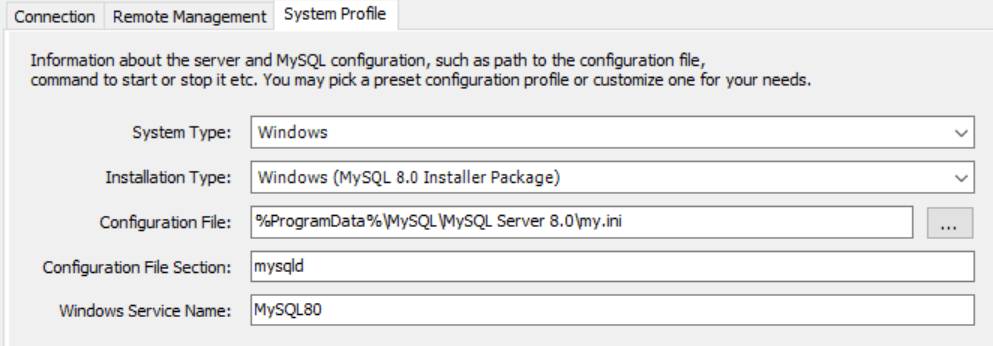

# 玩机Q&A
## MySQL安装后连接不上

背景：**Windows**重装MySQL并且立刻进入workbench后能正常数据库使用，但是重启或关机再开就连接不上了。

!!! tip "the path already exists"
    比如安装server我要装到`D:\MYSQL\server`，提示我`the path already exists`，那就把自己建的server文件夹删掉，填写`D:\MYSQL`即可

**可能的解决方案：**

终端（powershell）输入`& 'D:\MYSQL\server\bin\mysqld.exe' --defaults-file="D:\MYSQL\data\my.ini" `   ==别忘了切换成对应的文件夹==

为什么这么做呢？

这条命令的意思是把`D:\MYSQL\data\my.ini`的内容送给`D:\MYSQL\server\bin\mysqld.exe`执行。
我看网上有`net start mysql`但是我按照相关教程成功启动mysql后，workbench还是不能连接。后来又在StackOverflow[^1]上看到启动`MySQL57` 

我也做类似步骤，启动了`MySQL80`(因为我的配置里它就叫这个名字，对应下面的图中windows servers name),然后workbench成功连接👍

接下来再接再厉，在`services.msc`发现它其实就是相当于执行`D:\MYSQL\server\bin\mysqld.exe' --defaults-file="D:\MYSQL\data\my.ini`这条指令，但是我看workbench里的连接配置就是这个意思，但是不太明白为什么workbench没有成功，希望有高人指点。

   
[^1]: [对应的StackOverflow问题传送门](https://stackoverflow.com/a/37612256/21587403)